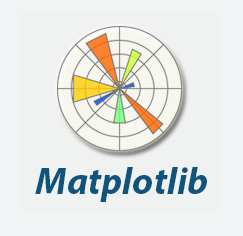
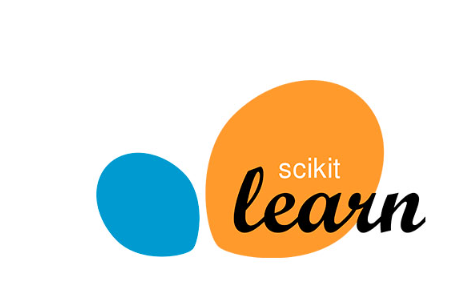
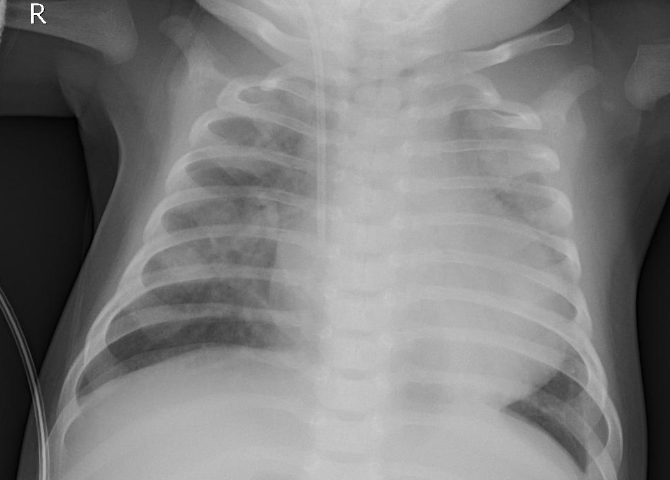
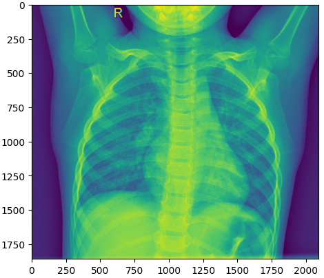
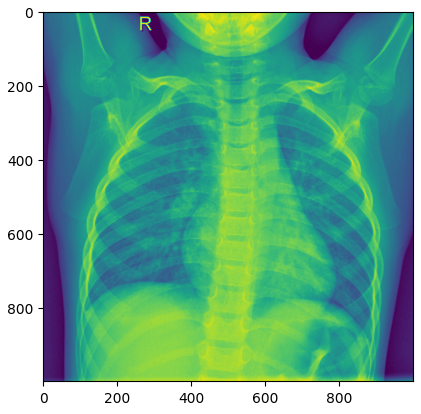
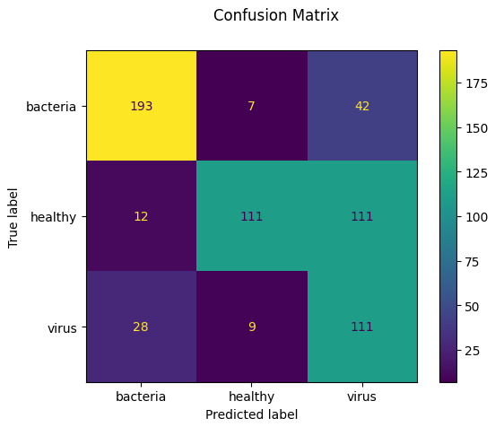

**Librairies :**

>Numpy :
    
offre des outils de conversion de tableau

    
  

 >Glob :
    
permet de coupler des fichiers selon un pattern donné

    
  

 >Pillow :
    
offre une optmisation dans le traitement et rendement d'images

    
  

 >MatPlotLib :
    
permet l'affichage de tableaux et d'images

    
  

> sklearn :
    
offre les model d'apprentissage et de test, ainsi que le gestion du dataset

    
  

>**Data :** 
   La data utilisée est un banque de données de radiographie de poumons.
    
   La banque offre un dataset de train et de test 
   

>**Reshape :** 
   Les images sont redimensinnées en (1000x1000) 
   
   
   

>**train model :** 
   L'algorithme d'apprentissage choisie est le SVM  
   

>**testing model :** 
   Pour la phase de test on lance le model avec 400 images et comme rendu on crée un matrice de confusion  
   
   